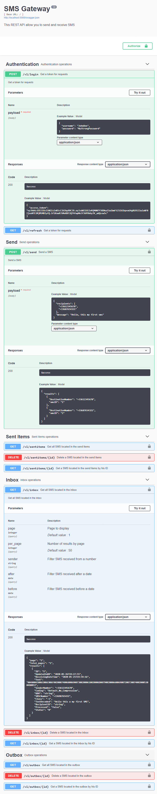

# SMS Gateway

This REST API allow you to send and receive SMS using gammu-smsd.

A 2.0 swagger documentation is provided at the root URL.

All routes can be protected by an authentication methode (Basic, Bearer).

# Table of Contents

* [Requirements](#Requirements)
* [Installation (docker-compose)](#Installation-(docker-compose))
* [Run containers](#Run-containers)
* [Environment Variables](#Environment-Variables)
* [My setup](#My-setup)
* [Screenshots](#Screenshots)

## Requirements

This project require a `SQL` database (mySQL, MariaDB, ...).

[A device supported by Gammu library](https://wammu.eu/phones/)

A sim card to send and received SMS.

## Installation (docker-compose)

Create a folder into the host for persistant data (SQL data)

    $ mkdir -p /opt/mariadb

Create `docker-complose.yml` file then modify or add environment variables if necessary

```
version: '3'
services:
  db:
    image: mariadb:11.4-ubi
    container_name: sms-gateway_db
    restart: always
    command: --transaction-isolation=READ-COMMITTED --binlog-format=ROW
    volumes:
      - /opt/mariadb:/var/lib/mysql
    environment:
      - MYSQL_ROOT_PASSWORD=UP5yeFxRcvtMBzjdfNmT6p
      - MYSQL_USER=sms-gateway
      - MYSQL_PASSWORD=Bpj7hXNCextgnzSWckFybV
      - MYSQL_DATABASE=smsd
    healthcheck:
      test: ["CMD", "healthcheck.sh", "--connect", "--innodb_initialized"]
      start_period: 15s
      interval: 15s
      timeout: 5s
      retries: 5
  backend:
    image: fizcko/sms-gateway:latest
    container_name: sms-gateway_server
    restart: always
    ports:
      - 5000:5000
    devices:
      - "/dev/ttyUSB2:/dev/phone"
    depends_on:
      db:
        condition: service_healthy
    environment:
      - MYSQL_HOST=db
      - MYSQL_USER=sms-gateway
      - MYSQL_PASSWORD=Bpj7hXNCextgnzSWckFybV
      - MYSQL_DATABASE=smsd
      - GAMMU_DEVICE=/dev/phone
```

# Run containers
```
$ docker-compose up -d
```

# Environment Variables

#### SERVER_IP
    default value   : "0.0.0.0"
    description     : Bind to a specific interface

#### SERVER_PORT
    default value   : "5000"
    description     : Define server port for backend API

#### GAMMU_SMSD_CONF
    default value   : "/etc/gammu-smsdrc"
    description     : Set path of the configuration file for gammu-smsd. This file is dynamically generated at container startup

#### GAMMU_DEVICE
    default value   : "/dev/ttyUSB0"
    description     : Path of the modem device mounted into the container
    more            : https://wammu.eu/docs/manual/config/index.html#option-Device

#### GAMMU_DEVICE_CONNECTION
    default value   : "at"
    description     : Protocol which will be used to talk to your device
    more            : https://wammu.eu/docs/manual/config/index.html#option-Connection

#### GAMMU_PIN
    default value   : "1234"
    description     : PIN for SIM card. If no pin on the SIM card leave default value
    more            : https://wammu.eu/docs/manual/smsd/config.html#option-PIN

#### GAMMU_DEBUG_LEVEL
    default value   : "0"
    description     : Log level for gammu-smsd
    more            : https://wammu.eu/docs/manual/smsd/config.html#option-DebugLevel

#### MYSQL_HOST
    default value   : "localhost"
    description     : Database server address

#### MYSQL_USER
    default value   : "root"
    description     : User name used for connection to a database

#### MYSQL_PASSWORD
    default value   : "toor"
    description     : Password used for connection to a database

#### MYSQL_DATABASE
    default value   : "smsd"
    description     : Name of database dedicated for gammu-smsd

#### JWT_SECRET
    default value   : "Change-this-secret-phrase"
    description     : The secret key needed for symmetric based signing algorithms

#### JWT_ALGORITHM
    default value   : "HS256"
    description     : Which algorithm to sign the JWT with
    more            : https://pyjwt.readthedocs.io/en/latest/algorithms.html

#### JWT_ACCESS_TOKEN_EXPIRES
    default value   : "900"
    description     : How long (in ms) an access token should live before it expires. Can be set to 0 to disable expiration.

#### API_SECURITY
    default value   : "None"
    allowed values  : "None" | "Bearer" | "Basic"
    description     : Select the authentication methode for the routes of the Rest API

#### API_USERNAME
    default value   : "admin"
    description     : User name used for connection to the rest API

#### API_PASSWORD
    default value   : "admin"
    description     : Password used for connection to the rest API


# My setup

[Raspberry Pi 4 Model B](https://www.raspberrypi.org/products/raspberry-pi-4-model-b/)

[Quectel EC25 Mini PCle 4G/LTE Module](https://sixfab.com/product/quectel-ec25-mini-pcle-4glte-module/)

[Raspberry Pi interface bridge](https://sixfab.com/product/raspberry-pi-3g-4glte-base-shield-v2/)

[LTE Antenna](https://sixfab.com/product/lte-main-diversity-dual-u-fl-antenna-100mm/)

# Screenshots


